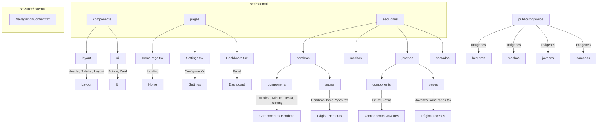

# Arquitectura Herz Edel App

---

- **Imágenes:** Se almacenan en `public/img/varios/...` y se usan en las galerías de cada sección.
- **Componentes y páginas:** Cada sección (hembras, machos, jóvenes, etc.) tiene sus propios componentes y página principal.
- **Navegación:** Se gestiona con React context (`NavegacionContext.tsx`).
- **Layout/UI:** Componentes compartidos para estructura y elementos visuales.
- **SEO:** Meta tags en `index.html` y Helmet en cada página.

Puedes visualizar este diagrama en VS Code con la extensión "Markdown Preview Mermaid Support" o en cualquier editor compatible con Mermaid.
