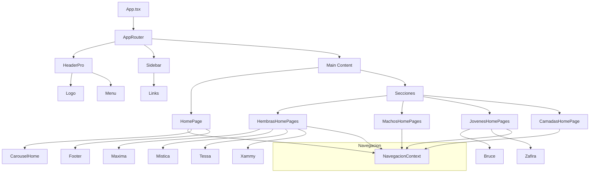

# Diagrama de Flujo de Componentes Herz Edel

---

- **App.tsx:** Punto de entrada, renderiza el router y layout principal.
- **AppRouter:** Gestiona las rutas y renderiza las páginas según la navegación.
- **HeaderPro/Sidebar:** Componentes de layout y navegación.
- **HomePage:** Página principal, incluye carrusel y footer.
- **Secciones:** Cada sección (hembras, machos, jóvenes, camadas) tiene su propia página y componentes de galería/detalle.
- **NavegacionContext:** Contexto para manejar el estado de navegación entre secciones y componentes.

Puedes visualizar este diagrama en VS Code con la extensión "Markdown Preview Mermaid Support" o en mermaid.live.
